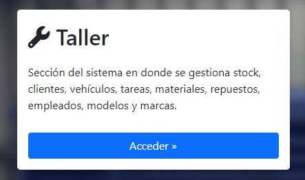
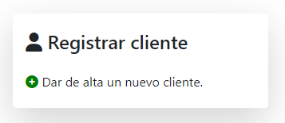
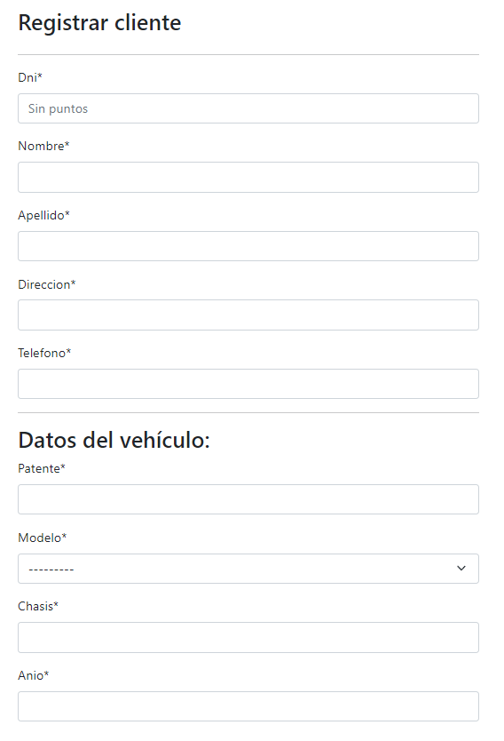

🧑 Cómo crear un cliente
========================

Para crear un nuevo cliente, debemos dirigirnos a la sección **Taller**.

Ingresar en la opción **Registrar cliente**

En el formulario debemos completar los campos con los datos del cliente (**DNI**, **nombre**, **apellido**, **dirección** y **teléfono**) y su vehículo (**patente**, **modelo**, **chasis**, **año del vehículo**)

(*) Se recomienda que, antes de completar los datos del cliente y su vehículo, se cree la **marca** y **modelo** del vehículo en cuestión.

Luego de haber cargado los datos, se debe clickear en el botón **Guardar y continuar registrando** o **Guardar y salir**, según sea la preferencia del usuario. En caso de que alguno de los campos ingresados no cumpla con los requisitos, se le solicitará verificar el error.
