Manejo de presupuestos
======================

.. _crear-presupuesto:

**************************
Creación de un presupuesto
**************************

Para crear un nuevo presupuesto, debemos dirigirnos a la sección **Presupuestos**.

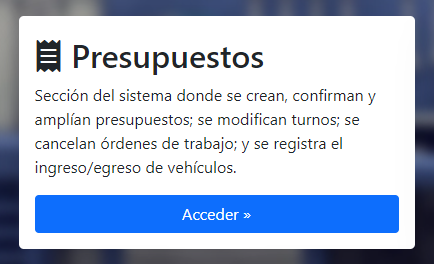

Ingresar en la opción **Crear presupuesto**

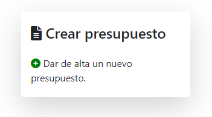

En el formulario debemos seleccionar el cliente a quien pertenece el presupuesto y posterior a esto, el vehículo sobre el cual se están presupuestando los arreglos. El campo **Detalles** tiene un carácter informal y es utilizado para agregar comentarios al respecto.

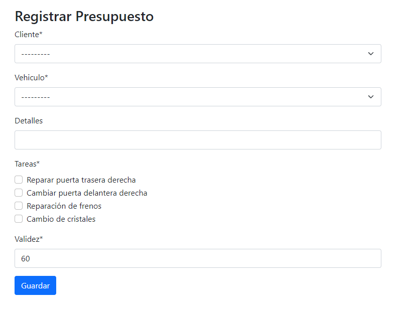

Luego de esto se seleccionan las tareas que se realizarán, y la cantidad de días de validez del presupuesto. Aquí hay distintas posibilidades:

- Si las tareas requiere repuestos: aparecerá en pantalla una tabla en la cual se deberán seleccionar los repuestos necesarios para realizarla, junto con sus cantidades.

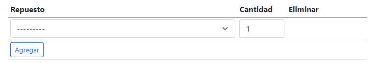

- Si las tareas requiere materiales: aparecerá en pantalla una tabla en la cual se deberán seleccionar los materiales necesarios para realizarla, junto con sus cantidades.

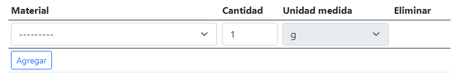

Luego de haber cargado todos los campos del formulario, se puede hacer click en **Guardar** para dejar el presupuesto registrado en el sistema. El sistema lo redirigirá al detalle del presupuesto.

.. _modificar-presupuesto:

******************************
Modificación de un presupuesto
******************************

Para modificar un presupuesto existente, debemos dirigirnos a la sección :ref:`seccion-listados`.

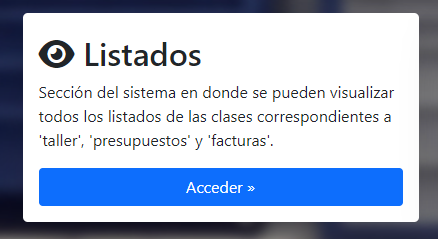

Y luego dirigirnos a la opción **Ver presupuestos**.

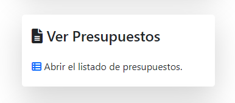

En el listado, debemos buscar el presupuesto deseado y pulsar el ícono 👁, para abrir su detalle.

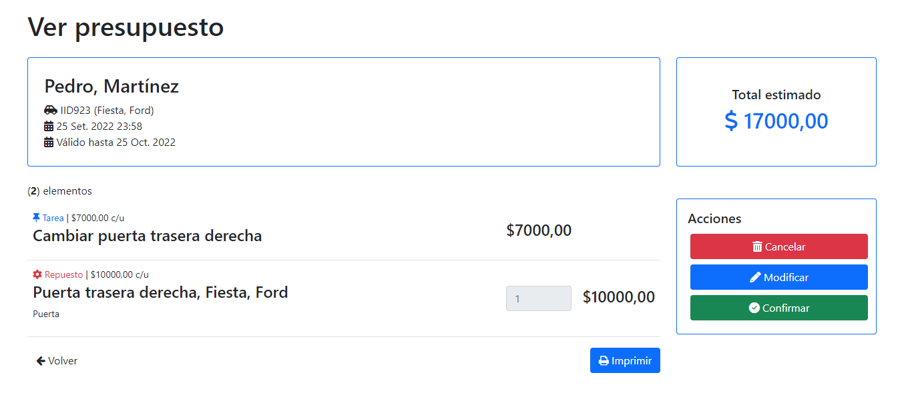

De las opciones de la derecha, en el recuadro de **Acciones**, debemos pulsar en **Modificar**.

.. image::  _static/acciones_presupuesto.png
   :align:  center

Luego de esto, se abrirá el mismo formulario que se utilizó para crearlo, pero con los campos ya cargados y disponibles para ser modificados.

.. image::  _static/modificar_presupuesto_form.png
   :align:  center

Una vez que se hayan efectuado los cambios en el presupuesto, se debe clickear el botón **Guardar** y los cambios habrán sido registrados en el sistema.

.. _cancelar-presupuesto:

*****************************
Cancelación de un presupuesto
*****************************

Para cancelar un presupuesto existente, debemos dirigirnos a su detalle del mismo modo que se mencionó en :ref:`modificar-presupuesto`. Una vez en el detalle del presupuesto, se debe clickear en la opción **Cancelar**, dentro del recuadro de *Acciones*.

.. image::  _static/acciones_presupuesto.png
   :align:  center

Al clickear en el botón, aparecerá un modal para que confirmemos la operación.

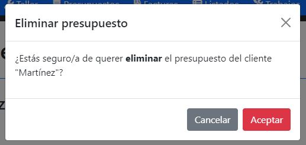

Al clickear en **Aceptar**, el presupuesto habrá sido cancelado exitosamente.

.. _confirmar-presupuesto:

******************************
Confirmación de un presupuesto
******************************

Para confirmar un presupuesto existente, se debe ingresar a su detalle del mismo modo que se mencionó en :ref:`modificar-presupuesto`. Una vez en el detalle del presupuesto, se debe clickear en la opción **Confirmar**, dentro del recuadro de *Acciones*.

.. image::  _static/acciones_presupuesto.png
   :align:  center

Al seleccionar la opción, el sistema nos solicitará la fecha y hora del turno, para luego poder crear la orden de trabajo asociada al presupuesto que se acaba de confirmar.

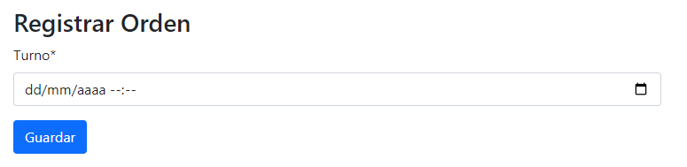

Luego de seleccionar una fecha y hora válida, el sistema nos mostrará el detalle de la orden de trabajo que se acaba de crear.

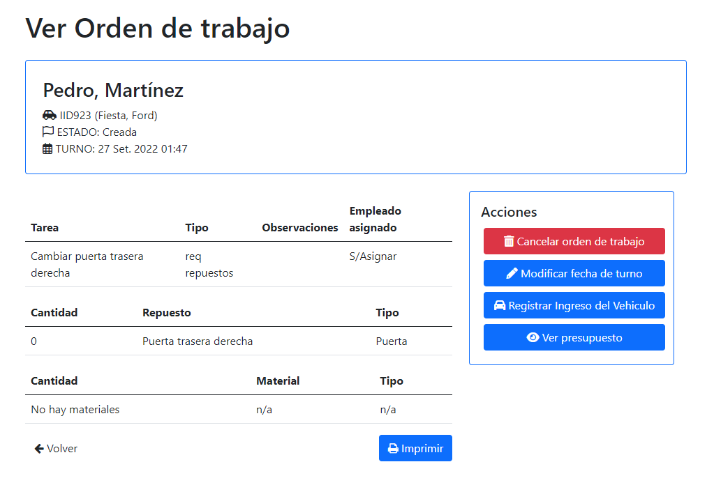

.. _ampliar-presupuesto:

****************************
Ampliación de un presupuesto
****************************

Para realizar la ampliación de un presupuesto, primero se deben cumplir las siguientes condiciones:

- El presupuesto a ampliar ha sido confirmado (ver :ref:`confirmar-presupuesto`).
- El vehículo ya se encuentra en el taller y se comenzó a trabajar en él.
- La orden de trabajo asociada se encuentra **pausada**.

Luego de esto, el botón con la opción **Ampliar presupuesto** estará disponible en las acciones de la orden de trabajo.

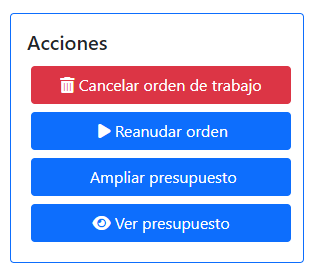

Al clickear en la opción **Ampliar presupuesto**, se abrirá un formulario similar al utilizado para crear el presupuesto (ver :ref:`crear-presupuesto`).
El nuevo formulario permitirá agregar nuevas tareas y quitar aquellas que no se hayan finalizado, así también como modificar los materiales y repuestos registrados en el presupuesto anterior.

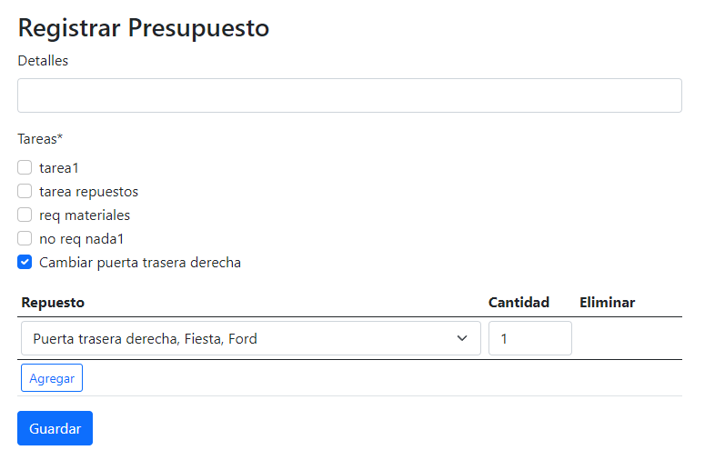

Al guardar los cambios efectuados, se mostrará un nuevo presupuesto, el cual deberá ser confirmado nuevamente para que repercuta en la orden de trabajo asociada. Al confirmar el nuevo presupuesto, se podrá reanudar la orden de trabajo y continuar con el trabajo normalmente.