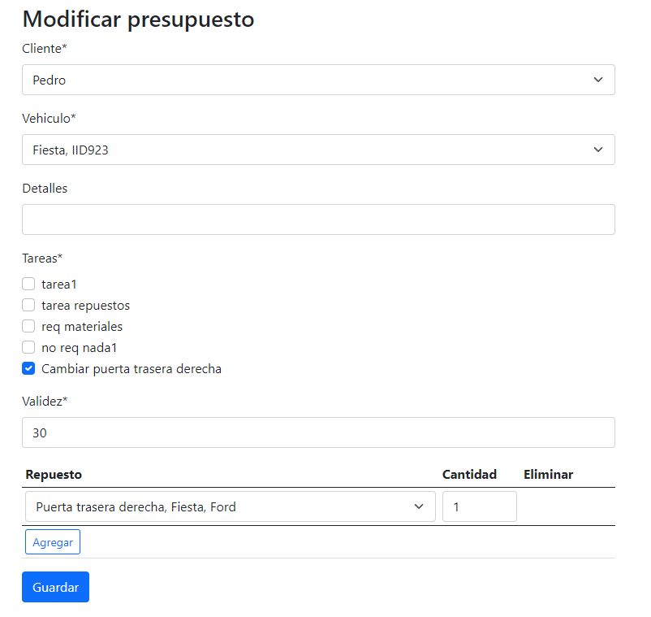

Manejo de presupuestos
======================

**************************
Creación de un presupuesto
**************************

Para crear un nuevo presupuesto, debemos dirigirnos a la sección **Presupuestos**.

.. image::  _static/boton_presupuestos.png
   :align:  center

Ingresar en la opción **Crear presupuesto**

.. image::  _static/boton_crear_presupuesto.png
   :align:  center

En el formulario debemos seleccionar el cliente a quien pertenece el presupuesto y posterior a esto, el vehículo sobre el cual se están presupuestando los arreglos. El campo **Detalles** tiene un carácter informal y es utilizado para agregar comentarios al respecto.

.. image::  _static/form_registrar_presupuesto.png
   :align:  center

Luego de esto se seleccionan las tareas que se realizarán, y la cantidad de días de validez del presupuesto. Aquí hay distintas posibilidades:

- Si las tareas requiere repuestos: aparecerá en pantalla una tabla en la cual se deberán seleccionar los repuestos necesarios para realizarla, junto con sus cantidades.

- Si las tareas requiere materiales: aparecerá en pantalla una tabla en la cual se deberán seleccionar los materiales necesarios para realizarla, junto con sus cantidades.

Luego de haber cargado todos los campos del formulario, se puede hacer click en **Guardar** para dejar el presupuesto registrado en el sistema. El sistema lo redirigirá al detalle del presupuesto.

.. image::  _static/boton_submit_form.png
   :align:  center

******************************
Modificación de un presupuesto
******************************

Para modificar un presupuesto existente, debemos dirigirnos a la sección **Listados**.

Y luego dirigirnos a la opción **Ver presupuestos**.

.. image::  _static/boton_ver_presupuestos.png
   :align:  center

En el listado, debemos buscar el presupuesto deseado y pulsar el ícono 👁, para abrir su detalle.

.. image::  _static/detalle_presupuesto.png
   :align:  center

De las opciones de la derecha, en el recuadro de **Acciones**, debemos pulsar en **Modificar**.

.. image::  _static/acciones_presupuesto.png
   :align:  center

Luego de esto, se abrirá el mismo formulario que se utilizó para crearlo, pero con los campos ya cargados y disponibles para ser modificados.

Una vez que se hayan efectuado los cambios en el presupuesto, se debe clickear el botón **Guardar** y los cambios habrán sido registrados en el sistema.

.. image::  _static/boton_submit_form.png
   :align:  center