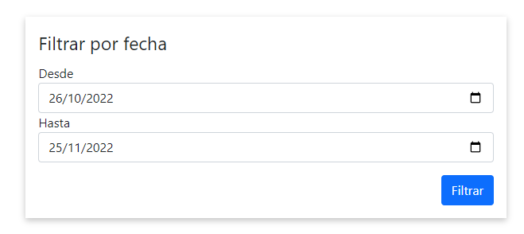
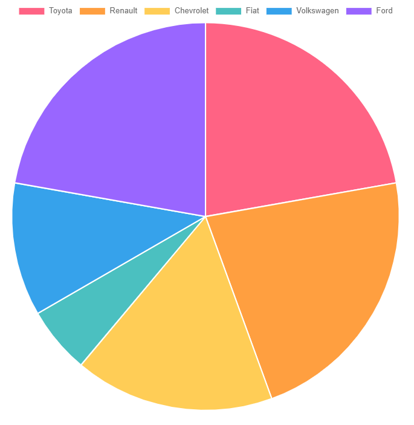
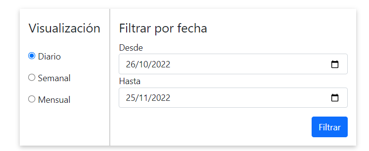
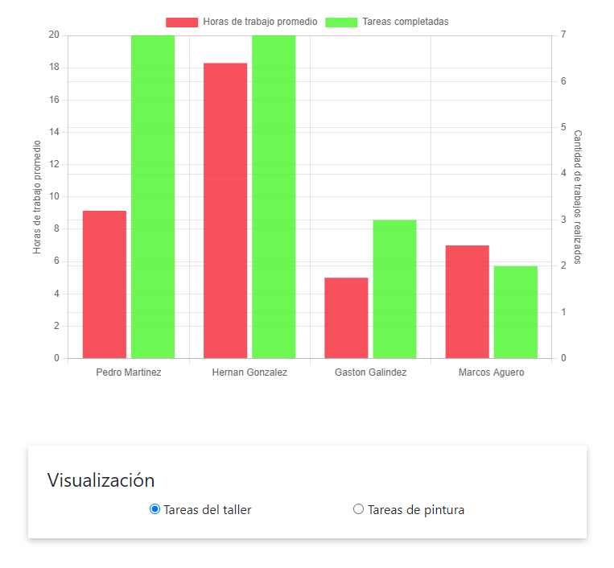
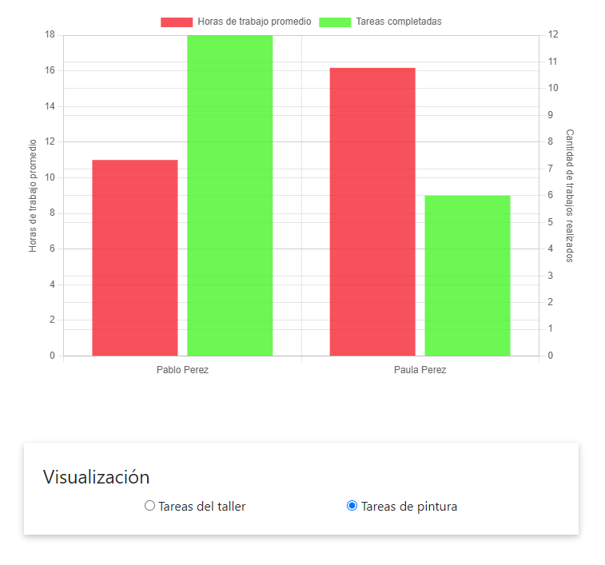
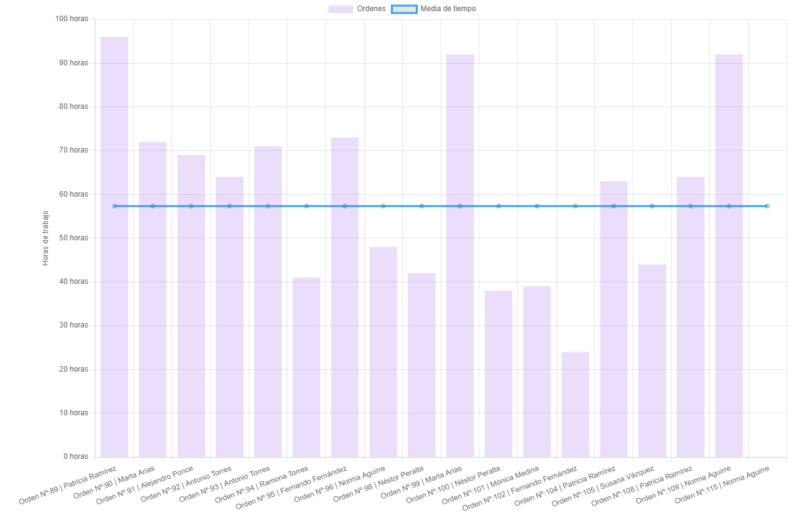

.. _reportes:

📊 Reportes
===========

.. _reporte-vehiculos-mas-recurrentes:

***************************************
🚗 Reporte de vehículos más recurrentes
***************************************
En este reporte, el usuario puede escoger un período de tiempo y el sistema le generará un gráfico de torta indicando cuáles fueron las marcas de vehículos que ingresaron al taller entre esas fechas, junto con su cantidad.

Ingresar período de tiempo:

(*) De forma predeterminada, el reporte generado contempla los últimos 30 días.

Ejemplo de reporte generado:

.. _reporte-facturacion:

**************************
💲 Reporte de facturación 
**************************
En este reporte, el usuario puede escoger un período de tiempo y el sistema generará un gráfico indicando la cantidad acumulada de dinero facturado, comparado con la cantidad acumulada de pagos registrados. La diferencia entre ambos valores es generada por los clientes VIP, quienes poseen la capacidad de retirar su vehículo sin haber abonado la totalidad de su factura.

Además de los campos presentados por el reporte de vehículos más recurrentes, este reporte también permite escoger la temporalidad del gráfico:

- Diario: cada 'punto' del gráfico representa un día.
- Semanal: cada 'punto' del gráfico representa una semana.
- Mensual: cada 'punto' del gráfico representa un mes.

(*) De forma predeterminada, el reporte generado contempla los últimos 30 días.

En la siguiente imagen se muestra el resultado de ingresar el período del 17/11/2022 al 25/11/2022, con temporalidad diaria.

.. image::  _static/reporte-facturacion.png
   :align:  center

.. _reporte-productividad:

***************************
🔨 Reporte de productividad 
***************************
En este reporte, se muestra un gráfico de barras con dos ejes verticales:

- Horas de trabajo promedio (izquierda): simboliza el tiempo promedio que le toma a un empleado realizar una tarea.
- Cantidad de tareas realizadas (derecha): simboliza la cantidad de tareas que realizó un empleado.

El reporte permite escoger entre las tareas de taller y las de pintura, mostrando en cada caso, los empleados que realizaron tareas del tipo seleccionado por el usuario.

Tareas del taller:

Tareas de pintura:

.. _reporte-ordenes:

*********************
📋 Reporte de órdenes 
*********************
En este reporte, se muestra el tiempo que tardó una orden de trabajo en realizarse, contemplando la fecha de ingreso y de egreso de cada vehículo que pasó por el taller, en un período determinado. Además, también muestra el promedio de tiempo que tarda una orden en completarse, simbolizada con una línea horizontal.

Del mismo modo que algunos de los reportes ya mencionados, este reporte cuenta con dos campos que permiten escoger el período a considerar:

.. image::  _static/form-reporte-ordenes.png
   :align:  center

(*) De forma predeterminada, el reporte generado contempla los últimos 30 días.

A continuación se muestra el gráfico generado por el reporte para el período 25/10/2022 al 25/11/2022

Como se puede observar, en el período ingresado se realizaron 17 órdenes, y el tiempo promedio es de 57 horas.

.. _reporte-clientes:

*************************
🙍‍♂️ Reporte de clientes 
*************************
En este reporte, se muestra de forma gráfica la relación que existe entre la cantidad de órdenes realizadas a un cliente y la cantidad facturada de esas órdenes. El reporte también diferencia entre clientes comunes y clientes VIP, mostrando a éstos últimos de otro color.

Los dos ejes principales de este reporte son:

- Cantidad de órdenes (eje horizontal): simboliza la cantidad de órdenes realizadas a un cliente.
- Cantidad facturada (eje vertical): simboliza la cantidad total facturada de un cliente.

.. image::  _static/reporte-clientes.png
   :align:  center

De este modo es posible observar que la mayoría de los clientes poseen entre una y dos órdenes, y que en general los clientes poseen menos de $10.000 facturados en total. 