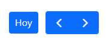
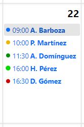
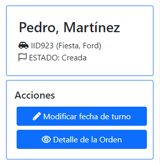

=======================
📆 Calendario de turnos
=======================

Para acceder al calendario de turnos, el usuario debe dirigirse a Listados > Ver turnos.

De forma predeterminada, el calendario estará posicionado en el mes actual. El usuario puede moverse entre los meses presionando los botones posicionados en la cabecera del calendario, y también volver al mes actual presionando en el botón "Hoy".

***************
👁‍🗨 Referencias
***************

En el calendario se mostrarán los turnos registrados. Cada turno está representado por:

- Punto de color: indica el estado de la orden de trabajo.
- Hora del turno. 
- Nombre del cliente.

En la imagen se puede observar que para el día 22 hay cinco turnos registrados.

- Punto de color azul: la orden de trabajo se encuentra **creada** (el vehículo aún no ingresó al taller).
- Punto de color amarillo: la orden de trabajo se encuentra **pausada**.
- Punto de color verde oscuro: la orden se encuentra **realizada**, **facturada** o **pagada**.
- Punto de color verde brillante: la orden se encuentra **iniciada** o **activa**.
- Punto de color rojo: la orden de trabajo se encuenta **cancelada**.

***********
🖐 Acciones
***********

Al seleccionar alguno de los turnos, sobre el lado derecho de la pantalla se abrirá un recuadro con una breve descripción de la orden de trabajo y algunas acciones.

La opción de "Detalle de la orden" estará disponible para todos los turnos, mientras que la opción "Modificar fecha de turno" solo estará disponible para aquellos turnos cuyo vehículo no haya ingresado al taller (representados con un punto azul).